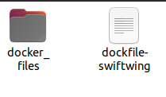

# 使用docker部署仿真环境
使用docker进行仿真环境的部署可以有效得与本机环境隔离，通常适用于不同环境变量下的多种仿真环境。

注意事项：新手小白不建议入门就开始使用docker，建议有一定的安装环境以及linux基础后，再考虑使用docker。建议初学者一定要自己从头安装一遍仿真环境，熟悉完整流程。

## 1 网络代理
docker中的网络代理可以参考此处[链接](https://neucrack.com/p/286)

## 2 dockerfile修改
1.提供的dockerfile的第8 9行，需要自行修改代理：
```shell
ENV HTTPS_PROXY=http://127.0.0.1:your port 
ENV HTTPS_PROXY=http://127.0.0.1:your port
```
2.默认下载PX4 1.15.0版本，如有需要，在dockerfile第64行可以指定PX4版本：
```shell
RUN git clone https://github.com/PX4/PX4-Autopilot.git -b v1.15.0 --recursive 
```
xx修改为你指定的版本
```shell
RUN git clone https://github.com/PX4/PX4-Autopilot.git -b v1.xx.0 --recursive 
```

## 3 docker build
将docker_files文件夹放到，与提供的dockerfile文件同目录下：



在该目录下新建终端窗口，使用以下命令进行build。"--network=host"为共享主机网络，"-f dockfile-swiftwing"指定本地dockerfile文件，"-t swiftwing_simulation:latest"为镜像命名且添加tag
```shell
sudo docker build --network=host -f dockfile-swiftwing -t swiftwing_simulation:latest .
```

如果卡在第一步，无法拉取"px4io/px4-dev-simulation-focal:2024-05-18"镜像，建议在build之前先拉取镜:
```shell
sudo docker pull px4io/px4-dev-simulation-focal:2024-05-18
```

## 4 docker run
首先在主机终端执行以下命令，开启docker的x权限：
```shell
xhost +local:docker
```

使用以下命令开启docker，可以进行图形化显示gazebo。
```shell
sudo docker run -it  --device=/dev/dri --group-add video --network=host --volume=/tmp/.X11-unix:/tmp/.X11-unix  --env="DISPLAY=$DISPLAY" swiftwing_simulation:latest /bin/bash
```

如果使用了"--network=host"参数，docker中启动飞机后，宿主机打开qgc地面站，可以自动连接飞机；

如果不使用"--network=host"参数，可以将px4的launch文件中的gcs_url从
```shell
<arg name="gcs_url" value=""/>
```
改为udp广播：
```shell
<arg name="gcs_url" value="udp-b://@"/>
```

如果不使用广播自动连接，可以在启动的rolaunch终端中新建一个mavlink链接，"192.168.x.xxx"为宿主机的ip地址：
```shell
pxh>  mavlink start -p -u 14556 -t 192.168.x.xxx-o 14550
```